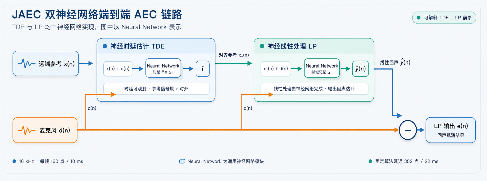

# JAEC

JAEC 是一个用于实时通信的 16 kHz 声学回声消除前端。此版本包含神经网络时延估计（TDE）和自适应线性处理（LP）运行时。它接收麦克风信号和远端参考信号，并返回 LP 输出。

原生运行时每次调用处理 160 个采样点（10 毫秒）。输出相对于麦克风输入保持固定的算法延迟，为 352 个采样点（22 毫秒）。

## 使用方法

JAEC 需要 **ModelScope > 1.39.1**。一旦兼容版本在 PyPI 上发布，请使用以下命令安装：

`python -m pip install -U "modelscope>1.39.1"`

在此之前，请从官方 `master` 分支安装 ModelScope：

`python -m pip install -U \   "modelscope @ git+https://github.com/modelscope/modelscope.git@master"`

使用两个等长的 16 kHz、单声道、PCM16 WAV 文件运行推理：

`from modelscope.outputs import OutputKeys from modelscope.pipelines import pipeline from modelscope.utils.constant import Tasks aec = pipeline(     Tasks.acoustic_echo_cancellation,    model='iic/speech_jaec_aec_16k',    device='cpu',    trust_native_code=True, ) result = aec(     {        'nearend_mic': 'https://dashscope.oss-cn-beijing.aliyuncs.com/samples/audio/jaec/nearend_mic.wav',        'farend_speech': 'https://dashscope.oss-cn-beijing.aliyuncs.com/samples/audio/jaec/farend_speech.wav',    },    output_path='output.wav', ) pcm16_bytes = result[OutputKeys.OUTPUT_PCM]`

`nearend_mic` 和 `farend_speech` 也可以是 WAV 字节数据或一维 `numpy.int16` 数组。流水线会在内部对不完整的最后一个 160 采样点帧进行填充，并将输出裁剪回原始长度。

模型仓库包含原生库。仅当加载您信任的仓库时，才设置 `trust_native_code=True`。

## 支持的平台

| 操作系统 | 架构 | 原生库 | 运行时要求 |
| --- | --- | --- | --- |
| macOS | Arm64 | lib/jaec\_arm.so | macOS 11 或更高版本 |
| Linux | x86-64 | lib/jaec\_x86.so | AVX2、FMA、glibc 2.27 或更高版本 |
| Windows | x86-64 | lib/jaec\_x86.dll | 64 位 Windows |

所附带的 Arm64 库是 macOS Mach-O 二进制文件，不支持 Linux Arm64、Android 或 iOS。本软件包不包含 32 位运行时。

## 运行时性能

每个 RTF（实时因子）是 10 次运行的中位数。计时区域涵盖 Python 每帧推理时间，不包括 WAV I/O 和模型初始化。

| 操作系统 | 架构 | CPU | 主频 | RTF |
| --- | --- | --- | --- | --- |
| macOS | Arm64 | Apple M4 | 4.46 GHz | 0.0020 |
| Linux | x86-64 | Intel Xeon | 2.90 GHz | 0.0039 |
| Windows | x86-64 | Intel Core Ultra 9 185H | 2.30 GHz | 0.0029 |

## 限制

-   输入必须是等长的 16 kHz 单声道 PCM16 信号，其中麦克风信号位于 `nearend_mic`，远端参考信号位于 `farend_speech`。
-   输出是 JAEC TDE+LP 前端的结果；本软件包不包含非线性处理（NLP）网络。
-   运行时兼容性仅限于上述列出的操作系统和架构。

---

*来源：[端到端回声消除-jaec-16k-base · 模型库](https://www.modelscope.cn/models/iic/speech_jaec_aec_16k)*